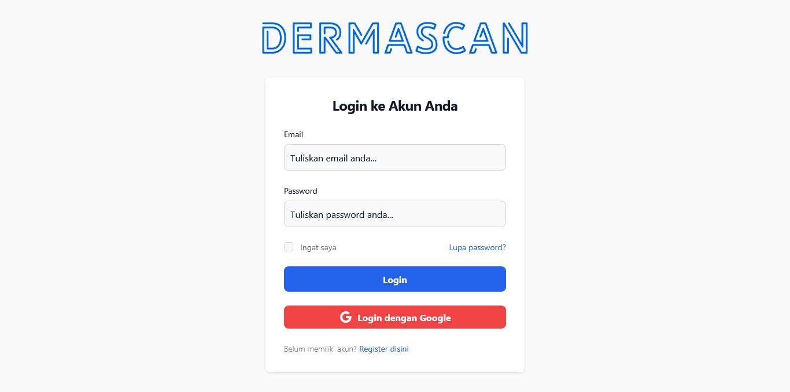
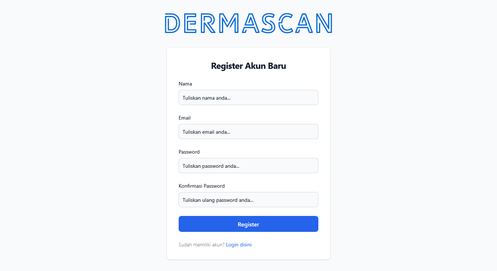
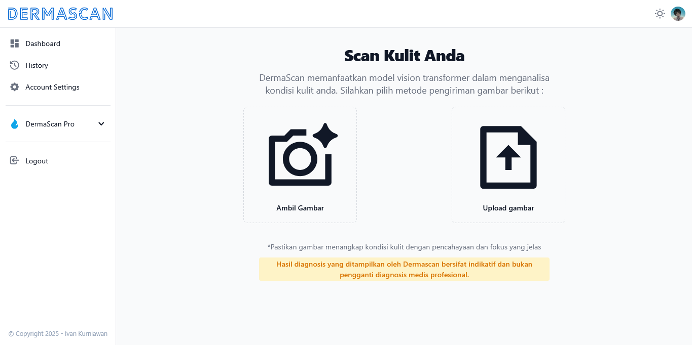
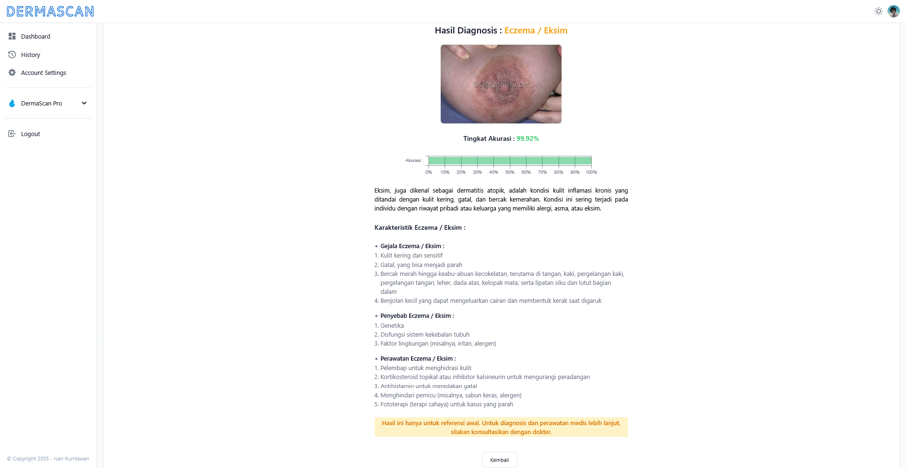
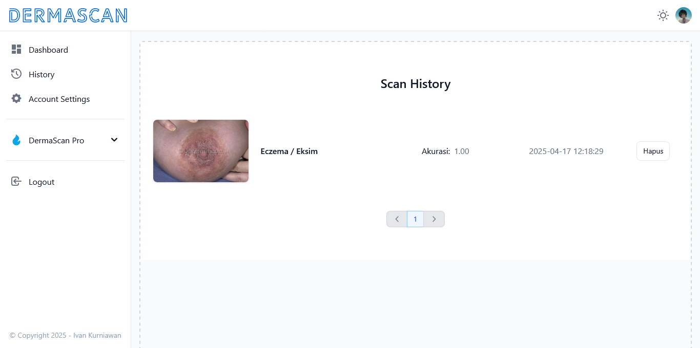
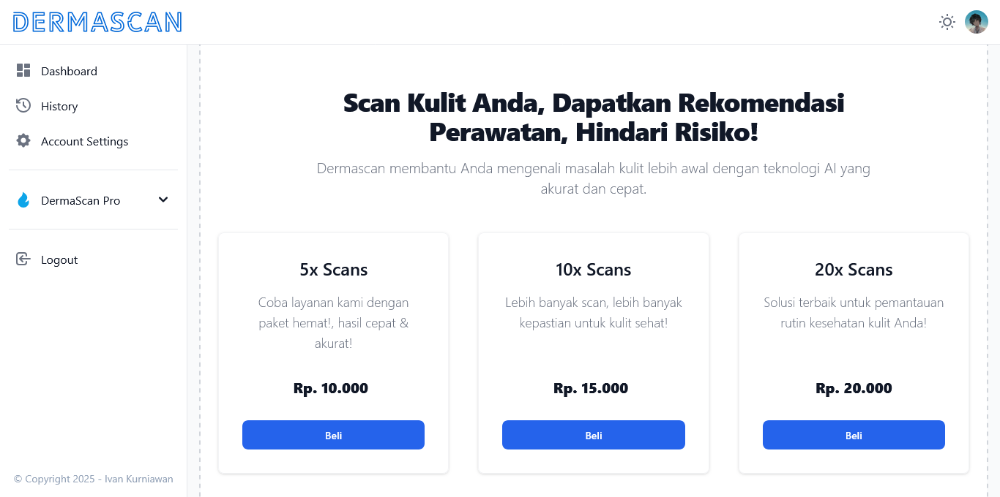
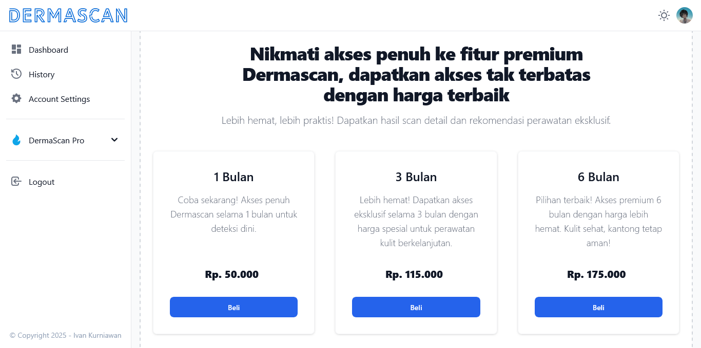
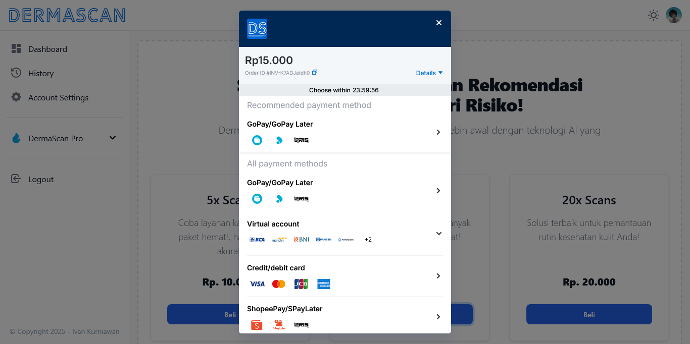
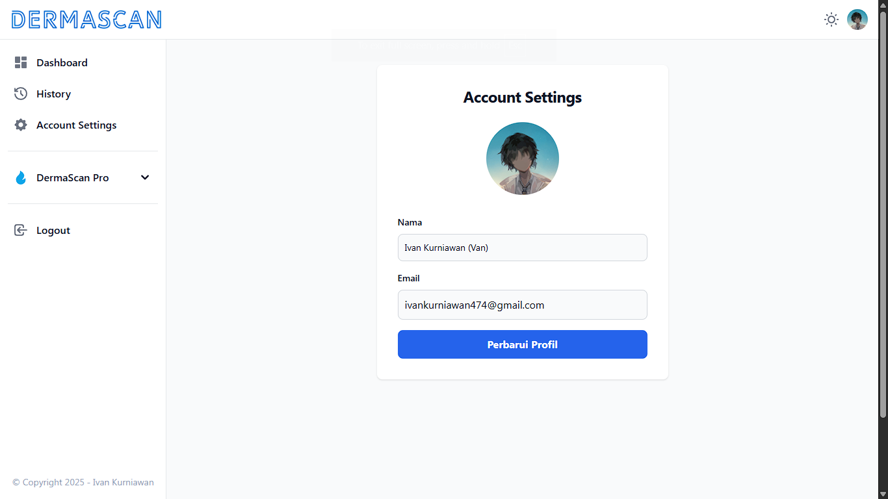

# DermaScan

**DermaScan** is a commercial web application designed to provide **self-diagnosis of 21 types of skin diseases** using an AI model.  
The AI model is adapted from the open-source repository: [Skin Diseases Detection](https://github.com/pacificrm/skinDiseasesDetection).

---

## ✨ Features

-   AI-powered self-diagnosis for skin diseases
-   User authentication and scan history tracking
-   Detailed diagnosis results with treatment recommendations
-   Integrated Midtrans payment gateway (Pay-Per-Use & Subscription)
-   Responsive user interface with Dark Mode

---

## 🛠 Tech Stack

        

---

## 📸 Screenshots

-   Login  
    
-   Register  
    
-   Dashboard  
    
-   Scan Result  
    
-   Scan History  
    
-   Pay-Per-Use  
    
-   Subscription  
    
-   Midtrans Payment Gateway  
    
-   Account Settings  
    
